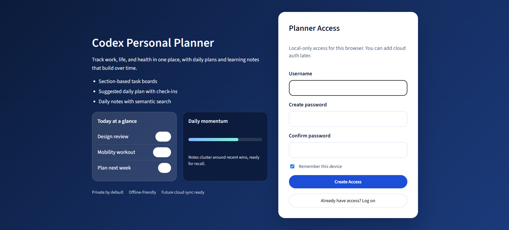
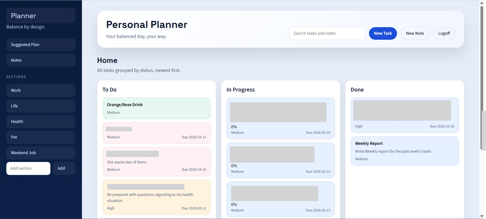
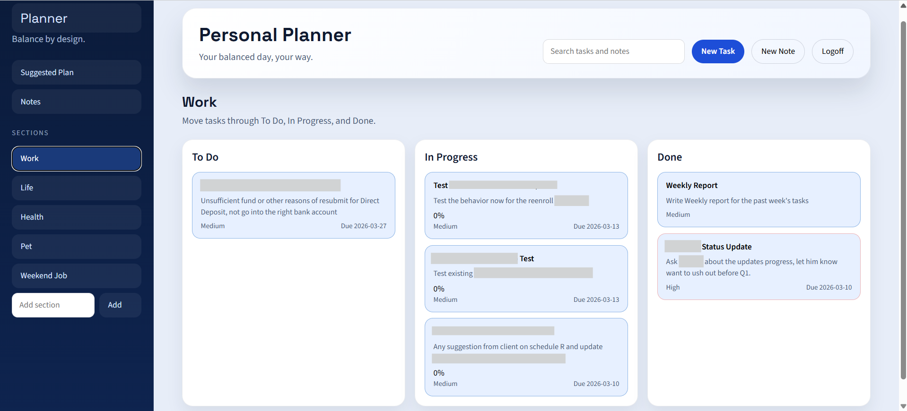
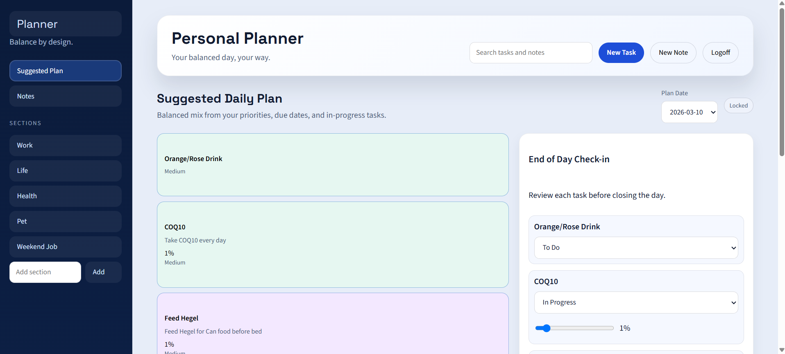
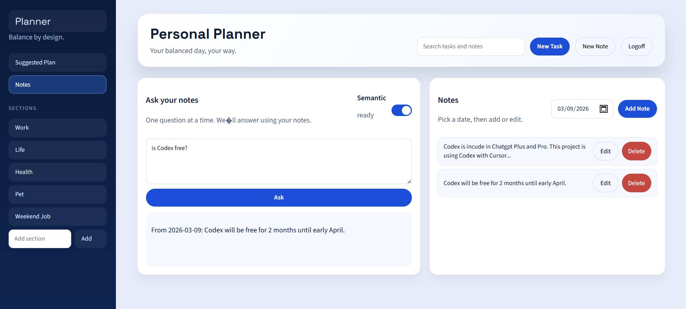

# Codex Personal Planner

A web-first personal manager for work, life, and health planning. It includes section-based task boards, daily plan suggestions, daily notes, and local semantic search for notes.

## Features
- Sections with To Do / In Progress / Done workflow
- Suggested daily plan (locked once created)
- Daily notes with tags and date filtering
- Per-task progress check-in and daily completion tracking
- Local semantic search for notes (no cloud)


## Tech Stack
- React + TypeScript + Vite
- IndexedDB for local storage
- Local embeddings via `@xenova/transformers`

## Screenshots







## Getting Started

Install dependencies:
```bash
npm install
```

Run the app:
```bash
npm run dev
```

## Local Semantic Search Assets
To enable local semantic search without network calls, download the model assets and ONNX runtime files:

```bash
python scripts/download_model.py
```

This will create:
- `public/models/all-MiniLM-L6-v2`
- `public/onnx`

These folders are ignored by git due to size. The app will still run without them, but semantic search will be disabled.

## Notes
- Data is stored locally in the browser using IndexedDB.
- Optional local login (password) lives only in the browser and is not real backend auth.
- Deploying to Vercel does not change storage behavior; data remains per-device and per-browser.
- Clearing browser data or switching devices will remove locally saved data unless a backend is added.
- If you want semantic search on other machines, re-run the download script after cloning.
